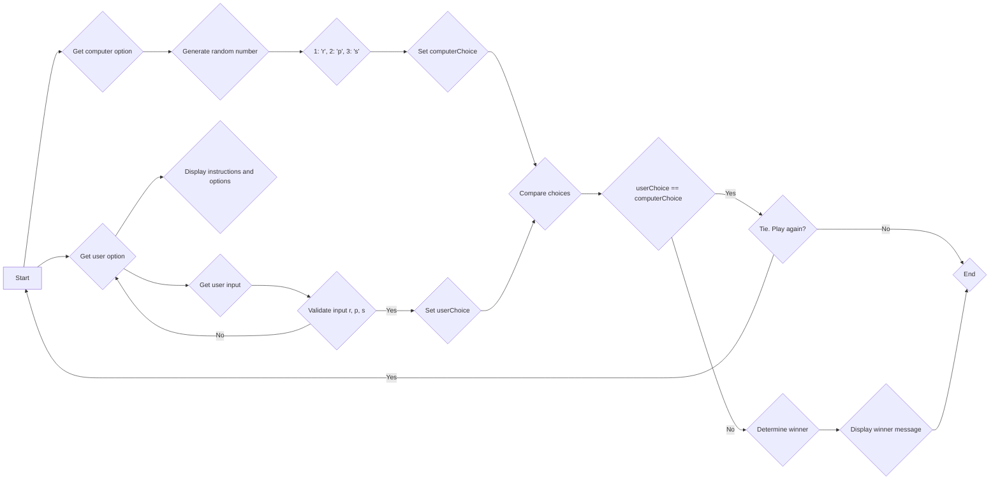

# R_P_S-Game-
c++

# flowchart 



```
#include <iostream>
using namespace std;

const char ROCK = 'r';
const char PAPER = 'p';
const char SCISSORS = 's';
 
char getComputerOption() {
    int num = rand() % 3 + 1;
 
    if(num==1) return 'r';
    if(num==2) return 'p';
    if(num==3) return 's';
    
    return '\0';
}
 void displayGameRules() {
    cout << "Welcome to Rock, Paper, Scissors!" << endl;
    cout << "The rules are as follows:" << endl;
    cout << "Rock beats Scissors" << endl;
    cout << "Paper beats Rock" << endl;
    cout << "Scissors beats Paper" << endl;
}
char getUserOption() {
    char c;
    cout << "Enter your choice (r, p, or s): " << endl;
    cin >> c;
    
    while (c!='r' && c!='p' && c!='s' )
    {
        cout << "Invalid input. Please enter r, p, or s." << endl;
        cin >> c;
    }
 
    return c;
}
 
void showSelectedOption(char option) {
    if (option == 'r') cout << "Rock" << endl;
    if (option == 'p') cout << "Paper" << endl;
    if (option == 's') cout << "Scissors" << endl;
}
 
void chooseWinner(char uChoice, char cChoice) {
    if (uChoice == ROCK && cChoice == PAPER) {
        cout << "Computer Wins! Paper wraps Rock."<< endl;
    }
    else if (uChoice == PAPER && cChoice == SCISSORS) {
        cout << "Computer Wins! Scissors cut Paper."<< endl;
        
    }
    else if (uChoice == SCISSORS && cChoice == ROCK) {
        cout << "Computer Wins! Rock smashes Scissors."<< endl;
        
    }
    else if (uChoice == ROCK && cChoice == SCISSORS) {
        cout << "You Win! Paper wraps Rock."<< endl;
        
    }
    else if (uChoice == PAPER && cChoice == ROCK) {
        cout << "You Win! Paper wraps Rock."<< endl;
        
    }
    else if (uChoice == SCISSORS && cChoice == PAPER) {
        cout << "You Win! Scissors cut Paper."<< endl;
    }
    else{
        cout << "Tie. Play again win the Game." << endl;
    }
}
int main() {

    char uChoice; 
    char cChoice;

    displayGameRules();
    while (true) {
    uChoice = getUserOption();
    cout << "Your choice is: "<< endl;
    showSelectedOption(uChoice);
    
    cout << "Computer's choice is: "<< endl;
    cChoice = getComputerOption();
    showSelectedOption(cChoice);
    chooseWinner(uChoice, cChoice);
 cout << "Do you want to play again? (y/n)" << endl;
        char playAgain;
        cin >> playAgain;
        if (playAgain == 'n') break;
        
    }
    return 0;
}
```
